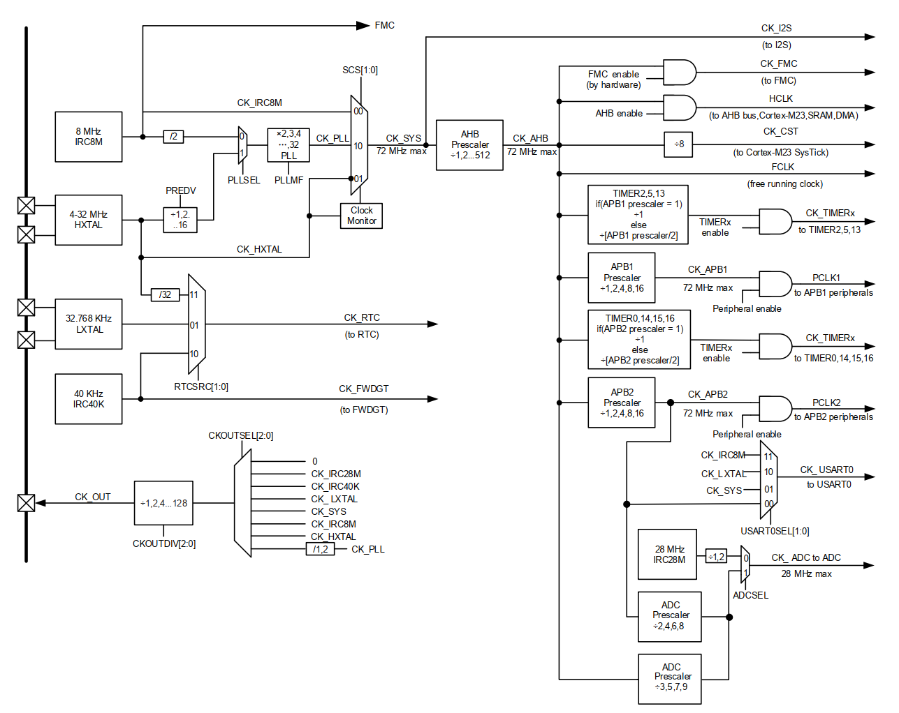

```shell
- gd32e23x\									# 标准库
  - core\
  - std\
  - template\
    - startup.s								# 启动文件
    - linker.ld								# 链接脚本
    - gd32e23x_libopt.h						# 配置选项
  - gd32e23x.h
  - system_gd32e23x.c
  - system_gd32e23x.h
- build.zig									# 构建配置（通用）
- src\
  - startup.s & linker.ld & gd32e23x_libopt.h
  #== 驱动层
  - gd32e23x_it.h & gd32e23x_it.c			# 硬件相关实现：中断服务
  - gd32e23x_tool.h & gd32e23x_tool.c		# 硬件相关实现
  - tool.h & tool.c							# 硬件无关实现
  #== 业务层
  - main.h & main.c
- justfile									# 构建指令（项目）
- README.md
```

# 时钟树



**总线时钟**：时钟源选择；系统时钟 `CK_SYS`；总线时钟 `CK_AHB`、`CK_APB1`、`CK_APB2`

+ **相关文件**：`system_gd32e23x.c` 与 `gd32e23x_libopt.h`
+ **注意事项**：FLASH 访问延迟需要与系统时钟频率匹配

**外设时钟**：在相关外设初始化函数中进行设置

# 串口通信帧

**串口参数**：8 数据位、无校验位、1 停止位；波特率 115200

+ **下行数据**：首先加入到环形队列，队列字节容量由 `./src/bsp.c :: UART_RECEIVE_RINGQ_SIZE` 定义，当队列满时， 多余数据将会被丢弃；

**帧协议**：下行帧描述对 MCU 的控制指令；上行帧描述 MCU 上传的信息数据；

+ **基本结构**：`帧起始 帧类型 数据域 帧结束`

|        帧类型         |          数据域           | 适用 |
| :-------------------: | :-----------------------: | :--: |
| **控制帧** `!`/`0x21` | `Command ByteCount Byte+` | 下行 |
| **文本帧** `"`/`0x22` |     `Uint32_t Byte+`      | 上行 |
| **数据帧 **`$`/`0x24` |     `Uint32_t Byte+`      | 上行 |
